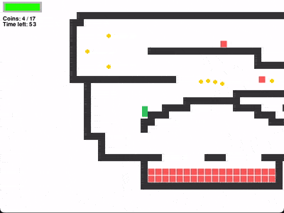
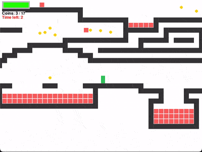
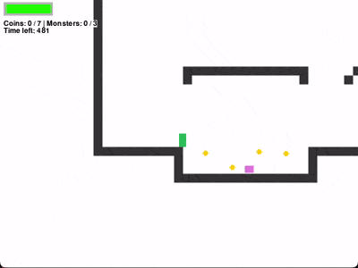
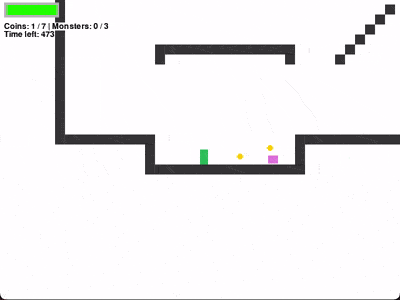

# Miniplatform
A 2D platform game written in Python.
Inspired by [Eloquent JavaScript](https://eloquentjavascript.net/16_game.html)

## Features

### Game mechanics
- Press `Left`/`Right` arrow keys to move sides. Press `Up` to jump.
- Collect all coins and kill all monsters to complete a level.
- Complete all the levels to win the game.
- Don't touch lava, or else you'll die and will start the level all over again.
- Jump on a monster to kill it. Don't let it run into you, or else you'll get killed!
- Press `z` to _stop time_. Pay attention to the power bar at the top left.
- Shake a leg! The game gets reset. _Once time's up, you'll start the whole game all over again! 

### Extra features
- A window re-sizes automatically to fit a screen size.
- _The game saves current progress_. After re-launching you go back to where you stopped.

## Preview

### Time stop


### Time's up. Game reset.


### A monster kills the player


### A monster gets killed by the player


## How to run
running via `uv`:
```bash
uv run miniplatform
```
